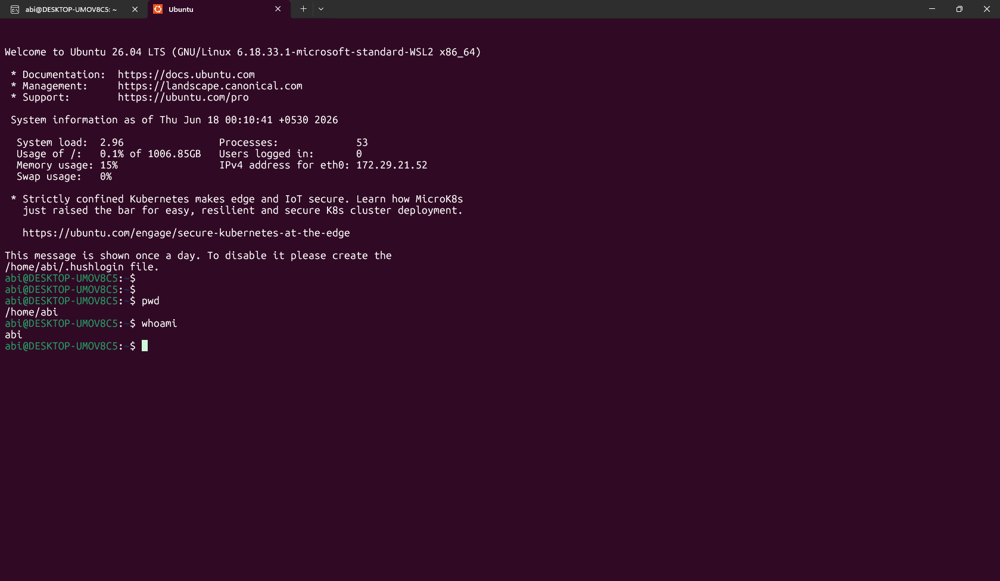

# 🐧 What is Linux

## 📖 Definition
Linux is a **free, open-source operating system (OS)** based on Unix principles.  
It controls the interaction between **software** and **hardware** in systems.

---

## ✅ Why Linux?
| Benefit | Description |
|---------|-------------|
| 🆓 Free & Open Source | No licensing costs; freely modifiable |
| 🔒 Secure | Strong permissions and user isolation |
| ⚡ Stable | Rarely crashes; runs for years without reboot |
| 🖥️ Server Ready | Powers majority of web servers worldwide |
| 🛡️ Cybersecurity | Preferred OS for security tools and testing |

---

## 🌍 Where is Linux Used?
- **Servers** – Backbone of the internet
- **Embedded Systems** – Routers, IoT devices, smart TVs
- **Smartphones** – Android is Linux-based
- **Cloud Computing** – AWS, Azure, Google Cloud run on Linux
- **DevOps** – Docker, Kubernetes, CI/CD pipelines
- **Supercomputers** – 100% of top 500 run Linux

---

## 💡 What I Learned
Linux is not just an OS. it's the **backbone of modern IT infrastructure**. From powering cloud platforms to enabling DevOps pipelines, Linux skills are **essential** for any tech professional.

## Screenshot

