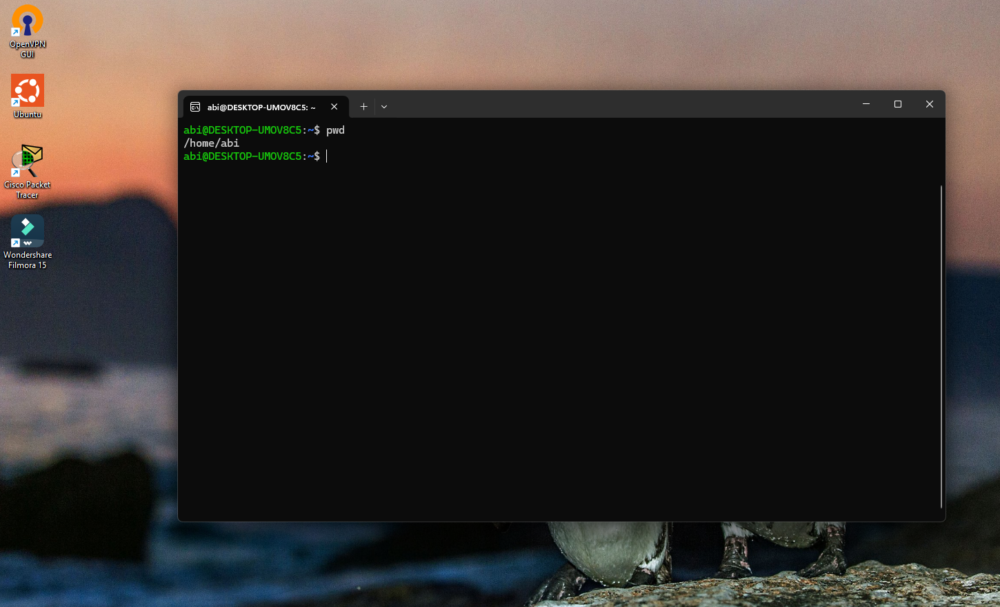
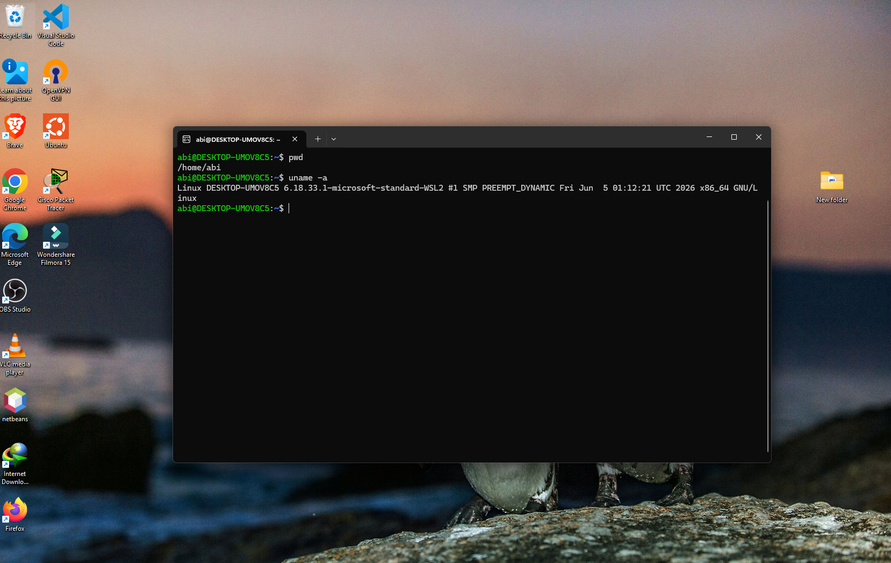
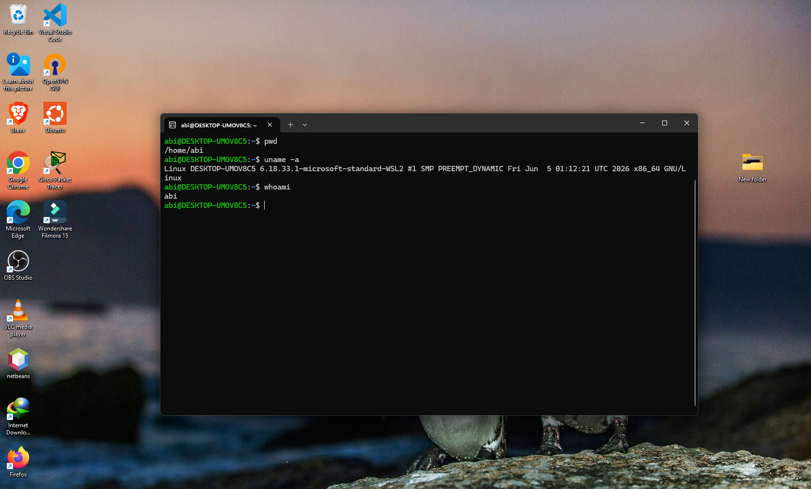
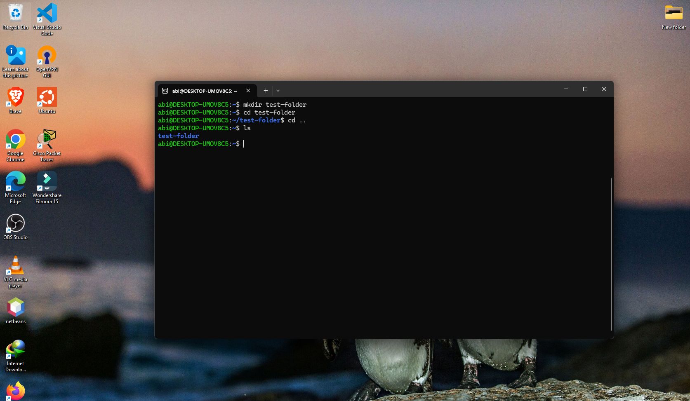
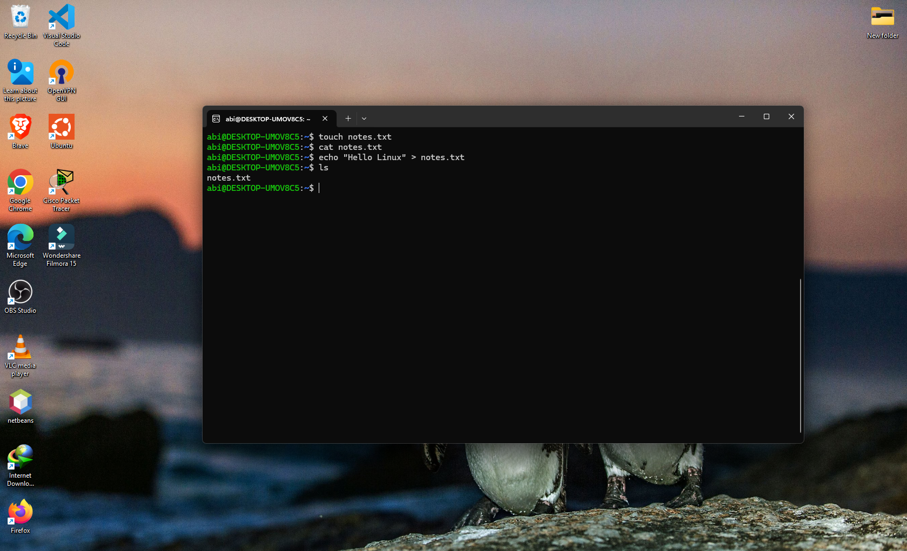

# Linux Basic Commands

## Overview

In this lab, I learned basic Linux commands used for navigation, file management, and system information.

---

## pwd

Displays the current working directory.

Example:

```bash
pwd
```

---

## uname -a

Displays detailed system information.

Example:

```bash
uname -a
```

---

## whoami

Displays the currently logged-in user.

Example:

```bash
whoami
```

---

## clear

Clears the terminal screen.

Example:

```bash
clear
```

---

## history

Shows previously executed commands.

Example:

```bash
history
```

---

## mkdir

Creates a new directory.

Example:

```bash
mkdir test-folder
```

---

## cd

Changes the current directory.

Example:

```bash
cd test-folder
```

Return to previous directory:

```bash
cd ..
```

---

## ls

Lists files and directories.

Example:

```bash
ls
```

Long listing:

```bash
ls -l
```

---

## rm

Removes files or directories.

Delete file:

```bash
rm file.txt
```

Delete directory:

```bash
rm -r test-folder
```

---

## touch

Creates an empty file.

Example:

```bash
touch notes.txt
```

---

## sudo

Runs commands with administrative privileges.

Example:

```bash
sudo apt update
```

---

## cat

Displays file contents.

Example:

```bash
cat notes.txt
```

---

## echo

Prints text to the terminal.

Example:

```bash
echo "Hello Linux"
```

Write text to a file:

```bash
echo "Hello Linux" > notes.txt
```

---

## Practice Lab

Commands used during practice:

```bash
mkdir linux-practice
cd linux-practice
touch notes.txt
echo "Hello Linux" > notes.txt
cat notes.txt
ls
pwd
```

---

## What I Learned

- How to navigate directories
- How to create files and folders
- How to view file contents
- How to remove files and folders
- How to check system and user information
- How to use basic Linux commands

---

## Screenshots

### Current Directory



### System Information



### Current User



### Directory Management



### File Creation and Reading



---

## Commands Summary

```bash
pwd
uname -a
whoami
clear
history
mkdir
cd
ls
rm
touch
sudo
cat
echo
```

---

## Conclusion

These commands form the foundation of Linux administration and are used daily by system administrators, cybersecurity analysts, and DevOps engineers.
